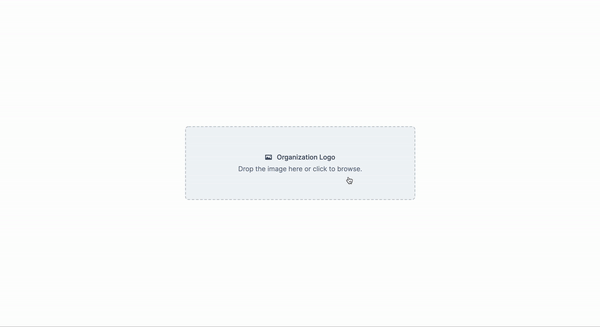

<h1 align="center">
  React Challenge </br>
  Frontend
</h1>

<p align="center">
  <a href="https://github.com/frassaolucas">
    
  </a>
  
</p>

<p align="center">
  
</p>

## About
This challenge consisted of creating a React component using Typescript to let users upload and crop avatars.

## Techs

-  [Typescript](https://www.typescriptlang.org/)
-  [ReactJS](https://reactjs.org/)

## Get started

1. Clone the repository

```sh
  $ git clone https://github.com/frassaolucas/logo-uploader-challenge
```

2. Run the application

```sh
  # Installing dependencies using yarn.
  $ yarn
```
or

```sh
  # Installing dependencies using npm.
  $ npm install
```

3. Run the application

```sh
  # Run application using yarn.
  $ yarn start
```
or

```sh
  # Run application using npm.
  $ npm start
```